<div align="center">

# **todo**

**ultra-light personal CLI task manager**

[](https://python.org)
[](.)
[](LICENSE)
[](CHANGELOG.md)
[](SECURITY.md)
[](https://luuucciiffeerr.github.io/TODO/)



**No accounts · No cloud · No background processes · One Python file**

[Install](#install) · [Quick start](#quick-start) · [Commands](#full-command-reference) · [Encryption](#encryption)

</div>

---

<div align="center">
  <a href="https://luuucciiffeerr.github.io/TODO/" style="display: inline-block; padding: 14px 40px; background: #00c66b; color: #000; text-decoration: none; font-weight: 600; border-radius: 6px; font-size: 16px;">
    ▶ View Animated Website — luuucciiffeerr.github.io/TODO/
  </a>
  <br><br>
  <em>Animated terminal demo · scroll-reveal features · full command reference · tabbed install · encryption stack</em>
</div>

---

## Features

| | |
|---|---|
| **Nested tags** — `#work #backend` hierarchies | **Priorities** — `!1` urgent · `!2` medium · `!3` normal |
| **Due dates** — `@YYYY-MM-DD`, overdue highlighting | **Encryption** — AES/Fernet with PBKDF2 (opt-in) |
| **Per-user data** — each OS user isolated | **Interactive TUI** — arrow keys on all platforms |
| **Zero deps** — works out of the box | **Atomic writes** — crash-safe file saving |

---

## Install

<div>
<table>
<tr>
<th width="33%">Linux / macOS</th>
<th width="33%">Windows</th>
<th width="33%">Manual</th>
</tr>
<tr>
<td>

```bash
curl -fsSL https://raw.githubusercontent.com/\
luuucciiffeerr/TODO/main/install.sh | bash
```

</td>
<td>

```powershell
irm https://raw.githubusercontent.com/\
luuucciiffeerr/TODO/main/install.ps1 | iex
```

</td>
<td>

```bash
cp todo.py ~/.local/bin/todo.py
echo 'exec python3 ~/.local/bin/todo.py "$@"' \
  > ~/.local/bin/todo
chmod +x ~/.local/bin/todo
```

</td>
</tr>
<tr>
<td colspan="3">

**Or clone:** `git clone https://github.com/luuucciiffeerr/TODO.git && cd todo && bash install.sh`

</td>
</tr>
</table>
</div>

---

## Quick start

```bash
todo -a buy milk                       # add a task
todo -a #work fix bug !1 @2026-06-15  # tagged + priority + due
todo                                   # view your list
todo -d 1                              # mark task #1 done
todo -r 1                              # remove task #1
todo --all                             # expand all tags
todo -i                                # interactive TUI
todo --help                            # full reference
```

---

## Full command reference

```
USAGE
  todo                          show tasks (tags collapsed)
  todo --all                    expand everything
  todo #work                    open tag by name
  todo #2                       open tag by number

ADDING
  todo -a fix the bug           add task to root
  todo -a #work fix bug         add to tag (creates if missing)
  todo -a #work #backend bug    nested tag path
  todo -a !1 urgent thing       priority
  todo -a call @2025-05-30      due date
  todo -a #work !1 @2025-05-30  all combined

MODIFYING
  todo -d 3                     toggle done
  todo -e 2 new text            edit task
  todo -m 2 up|down             reorder

REMOVING
  todo -r 3                     remove task
  todo -r #work 2               remove inside tag
  todo --rmtag #work            remove tag + contents

SEARCH & MISC
  todo -s keyword               search across all tags
  todo --clear                  wipe everything (confirms)
  todo --version                print version

ENCRYPTION
  todo --encrypt                encrypt data with password
  todo --decrypt                remove encryption
```

---

## Interactive TUI

Run `todo -i` for a full-screen interface with arrow-key navigation.

| Key | Action | Key | Action |
|---|---|---|---|
| `↑` `↓` | Navigate | `Space` | Toggle done |
| `→` | Expand tag | `d` | Delete task/tag |
| `←` | Collapse tag | `a` | Add task |
| `t` | New tag | `e` | Edit / rename |
| `q` | Quit | | |

---

## Encryption

```bash
pip install cryptography
todo --encrypt
```

| Stack | Detail |
|---|---|
| Algorithm | AES-128-CBC (Fernet) |
| KDF | PBKDF2-HMAC-SHA256 |
| Iterations | 480,000 (NIST 2023) |
| Salt | 32-byte random, per-user |
| Writes | Atomic (tmp → rename) |

Password via `TODO_PASSWORD` env var avoids shell history.

> ⚠ No password recovery. Back up your `.salt` file alongside `tasks.json`.

---

## Data location

| OS | Path |
|---|---|
| Linux | `~/.local/share/todo/tasks.json` |
| macOS | `~/.local/share/todo/tasks.json` |
| Windows | `%APPDATA%\todo\tasks.json` |

Data directory: `chmod 700` on Unix. Each OS user isolated.

---

## Requirements

- **Python 3.8+** — no other required dependencies
- `cryptography` package (optional, for `--encrypt`/`--decrypt`)

---

<div align="center">

**made to be used, not configured**

[MIT License](LICENSE) · [Security](SECURITY.md) · [Changelog](CHANGELOG.md) · [Contributing](CONTRIBUTING.md) · [Animated Website](https://luuucciiffeerr.github.io/TODO/)

</div>
